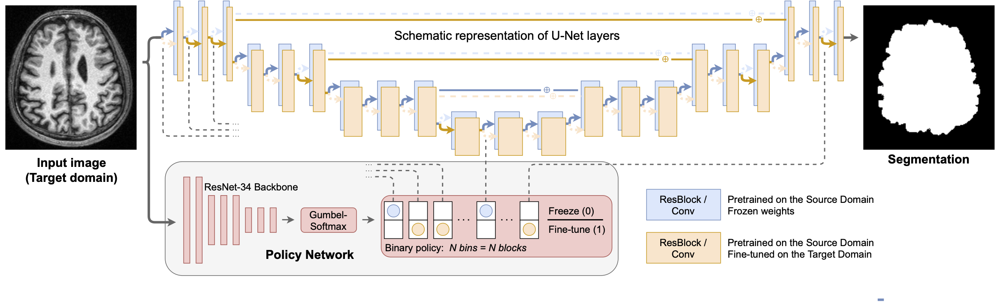

Hello! :vulcan_salute:

Here, you may find the code for the paper
**Anatomy of Domain Shift Impact on U-Net Layers in MRI Segmentation**
submitted to MICCAI-2021 conference. Below are the instructions,
allowing for reproduction of the experiments.



### Setting up the Libraries:

###### 1. Install our `spottunet` module:
```
git clone https://github.com/neuro-ml/domain_shift_anatomy.git
cd domain_shift_anatomy
pip install -e .
``` 

###### 2. Install `surface-distance`:
```
git clone https://github.com/deepmind/surface-distance.git
pip install surface-distance/
```

Original repository: https://github.com/deepmind/surface-distance

There is a minor error in `surface_distance/metrics.py`:
the line `102` should be commented, please do it
(might be already fixed by the time you are reading this)

###### 3. Python & PyTorch versions we used:
1) Python: 3.8.5
2) torch: 1.8.1 

### Reproducing the Experiments 

1. The path to your local copy of CC359 should be specified here: `config/assets/dataset/cc359.config`. You should place `config/assets/dataset/meta.csv` in the same folder with the data. From the available in `CC359` ground truths we used the "Silver standard" binary mask (https://sites.google.com/view/calgary-campinas-dataset/download)

2. You should specify the 'device' on which you are going to run an experiment by setting the corresponding variable 'device', in `/config/assets/core/` (line 78)

3. To run a single experiment, please follow the steps below:

First, the experiment structure should be created:
```
dpipe-build /path/to/the/config /path/to/the/experiment
# e.g.
dpipe-build ~/config/experiments/unet2d/unfreeze_first.config ~/dart_results/unfreeze_first
```

where the first argument is the path to the `.config` file and the second argument is the path to the folder where the experiment structure will be organized.

Then, to run an experiment please go to the experiment folder inside the created structure (`i` corresponds to the particular experiment, i.e. to the particular source-target pair):
```
cd ~/dart_results/unfreeze_first/experiment_{i} 
```

and call the following command to start the experiment:

```
dpipe-run ../resources.config
```

where `resources.config` is the general `.config` file of the experiment.

4. First, you should run `one2all` baseline. The models trained are utilized in the dowstream fine-tuning experiments. 
You should specify the folder, where these models are stored in the `baseline_exp_path` variable, which is present in each downstream experiment config. 
